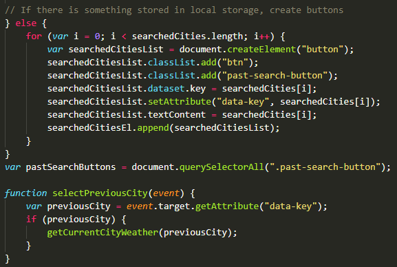
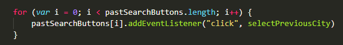

# Weather-dashboard

## About the project

This project required the creation of a weather dashboard from scratch--no starter code. Therefore, a HTML, CSS and script file all needed to be created to meet the user story and acceptance criteria.

> The final project can be found at: https://chardige.github.io/Weather-dashboard/

> The final HTML, CSS and Script can be found at: https://github.com/CharDige/Weather-dashboard

## The user story

```
AS A traveller
I WANT to see the weather outlook for multiple cities
SO THAT I can plan a trip accordingly
```

## Acceptance criteria


```
GIVEN a weather dashboard with form inputs
WHEN I search for a city
THEN I am presented with current and future conditions for that city and that city is added to the search history
WHEN I view current weather conditions for that city
THEN I am presented with the city name, the date, an icon representation of weather conditions, the temperature, the humidity, the wind speed, and the UV index
WHEN I view the UV index
THEN I am presented with a color that indicates whether the conditions are favorable, moderate, or severe
WHEN I view future weather conditions for that city
THEN I am presented with a 5-day forecast that displays the date, an icon representation of weather conditions, the temperature, the wind speed, and the humidity
WHEN I click on a city in the search history
THEN I am again presented with current and future conditions for that city
```

Other requirements included:

- using the [OpenWeather API](https://openweathermap.org/api) to retrieve weather data (I used both the One Call API and the Current Weather API)
- using `localStorage` to store persistent data.

## Technologies used

- [Bootstrap](https://getbootstrap.com/docs/5.1/getting-started/introduction/)
- [Google Fonts](https://fonts.google.com/)
- [Moment.js](https://momentjs.com/)
- HTML
- JavaScript
- CSS
- API (specifically [OpenWeather API](https://openweathermap.org/api))

## The process

As I had done with previous assignments, I used the acceptance criteria to break down the problem into smaller pieces.

The unique aspect of my process with this assignment was the amount of trial and error I went through to get the API to work, and to get the design to be responsive and be displayed as I wanted it to. I spent a lot of time using Google DevTools to troubleshoot issues and then move those fixes into the code.

Here's a summary of my process, which can be seen in more detail in the commits tab:

1. Initial structue of HTML created, which would then be built on through the Script (i.e. appending child elements).

2. Switched from jQuery back to vanilla JavaScript for preference for what I was trying to achieve.

3. Tested my fetch requests in the console, then added in the `appendChild` function to start showing certain variables and queries on the page as separate elements.

4. Created the first of the five-day forecast cards, and then copied across the functionality for all five days.

6. Added in `localStorage` functions, and used a lot of trial and error to fix bugs with displaying the items within the `localStorage` as buttons, and then getting those buttons to display the weather for those previously searched cities.

7. Adjusted the HTML multiple times once the functionality was working, so I could work on the design and ensure a responsive layout.

8. Added style choices to personalise the final weather dashboard look-and-feel.

## Final


> The final project can be found at: https://chardige.github.io/Weather-dashboard/

> The final HTML, CSS and Script can be found at: https://github.com/CharDige/Weather-dashboard

## Challenges and what I learnt

My greatest challenge stemmed from the `localStorage` requirement. I referred back to some of my previous code in other assignments to steer me in the right direction to be able to display the previously searched cities. However, I bumped into a bug where a new line of previously searched for cities would appear but the previous line wouldn't be removed.

Through trial and error, as well as reaching out for assistance, I found that clearing the `innerHTML` in this process fixed this bug, making this functional.


I then was challenged with getting the buttons of previously searched for cities to work, so that when a user clicked on a previously searched for city, it would fetch the right information. Through a lot of trial and error as well as pulling from previous knowledge of JavaScript, I assigned each previously searched for city with a `data-key`. Then, using a `for` loop, I could iterate through the `data-key` of each city, assigning each one with it's relevant city.



This then allowed me to assign a function to those buttons (also using a `for` loop), so that each button would fetch the right results.



From overcoming these challenges, I've learnt a lot more and grown my confidence in using things such as `data-key` and `for` loops.

## Credits

I pulled on a lot of previously learned knowledge to produce this assignment, rather than referring to other websites. However, I have provided references to the pages I did refer to below:

Coyier, C. (2022, February 20), *A Complete Guide to Flexbox*, CSS-Tricks, https://css-tricks.com/snippets/css/a-guide-to-flexbox/

W3 Schools (2022), *HTML DOM Document createElement()*, W3 Schools, https://www.w3schools.com/jsref/met_document_createelement.asp

Cancer Council (2022), *UV Index*, Cancer Council, https://www.cancer.org.au/cancer-information/causes-and-prevention/sun-safety/uv-index


## License

MIT License

Copyright (C) 2022 Charlotte Dige